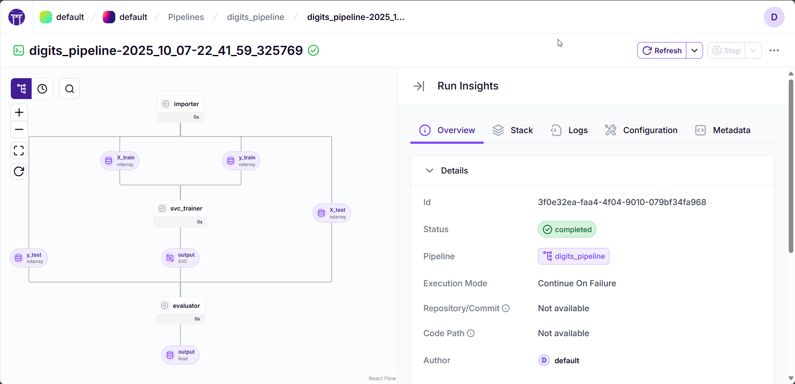

# ZenML Intro Pipeline


---

### 🧩 Project Overview
This notebook demonstrates how to **convert a standard Scikit-learn experiment** into a **modular and reproducible ZenML pipeline**.

We use the classic **Digits dataset** to train and evaluate a Support Vector Classifier (SVC) — first as a plain script, then as a structured ZenML pipeline.

The project aims to help beginners understand **how ZenML structures and automates ML workflows** for reproducibility and production readiness.

---

## Introduction

Machine Learning experiments often begin as quick scripts or notebooks — but they become difficult to reproduce or scale.

**ZenML** bridges that gap by turning scripts into **modular ML pipelines** that are:
- Reproducible  
- Trackable  
- Easily deployable  

In this project, we move from a simple `train_test()` function to a **three-step ZenML pipeline** composed of:
1. `importer` → Load and split data  
2. `svc_trainer` → Train the model  
3. `evaluator` → Evaluate accuracy  

---

## Technologies Used
| Category | Tools |
|-----------|-------|
| Language | Python 3.12 (caution: 3.13 and above not supported by ZenML) |
| ML Framework | scikit-learn |
| MLOps Framework | ZenML |
| Environment | Jupyter Notebook |
| Utilities | NumPy, Pandas, Typing |

## How to Run
#### 1️⃣ Install Dependencies
```bash
pip install requirements.txt
```

#### 2️⃣ Initialize ZenML
```bash
zenml init
```

#### 3️⃣ (Optional for Dashboard)

If running on Windows:
```bash
zenml login --local --blocking
```

#### 4️⃣ Run the Notebook

Execute all notebook cells.
To actually run the ZenML pipeline:
```python
digits_svc_pipeline = digits_pipeline()
digits_svc_pipeline.run()
```

## Expected Output
After running the pipeline, you should see output similar to:
